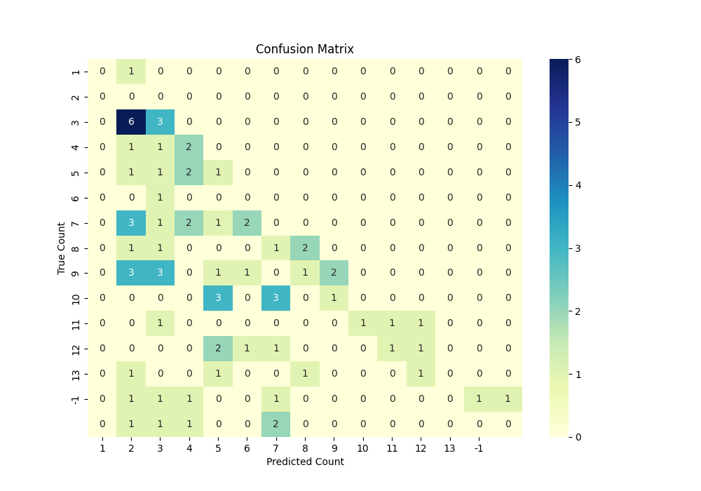
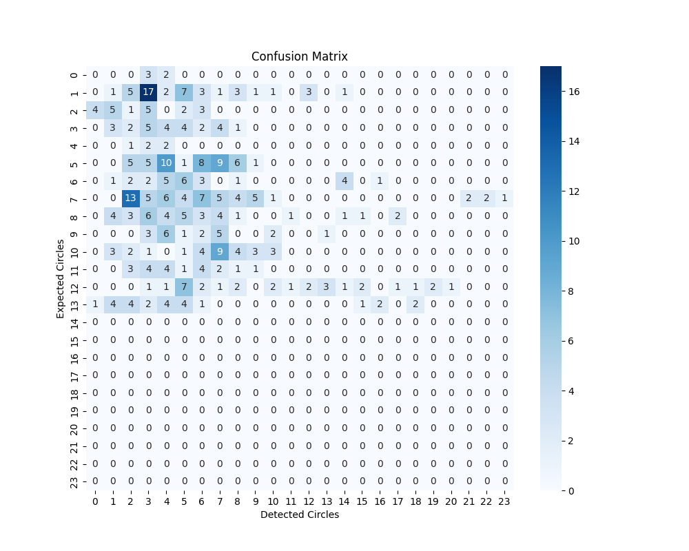

# Mixtec Research : Classification Models and Object Detection

## Overview of the project
The Mixtec Research Project aims to decode the rich and intricate Mixtec manuscripts, ancient documents created by the Mixtec civilization of present-day Oaxaca, Mexico. These manuscripts are unique in their structure, as they narrate stories through vibrant drawings and symbolic imagery, rather than through a linear text format. Each page of a Mixtec manuscript unfolds a narrative, often depicting mythological tales, historical events, or genealogies of Mixtec rulers. Our long-term vision is to develop a model capable of understanding and recognizing the entire story presented on a manuscript page, capturing the depth and flow of the narrative as intended by its creators.

As part of this broader goal, we have been working on training and refining our model to identify and classify individual symbols and patterns within the manuscript. By focusing on the foundational elements of the scripts, we aim to build a system that can later synthesize these components into coherent stories, paving the way for deeper insights into the cultural and historical context of the Mixtec civilization.

## Overview of the Mixtec Codices and the classification task

#### What are Mixtec Codices?
The Mixtec codices are extraordinary semasiographic manuscripts crafted from deerskin and folded into accordion-style “fold-books,” offering a window into the rich history and culture of the Mixtec civilization. These visually stunning works, like the famed tale of Lord Eight Deer Jaguar Claw—who united much of the Mixtec region—blend art and storytelling, chronicling origin myths, conquests, and the divine lineage of rulers. Referred to as _tonindeye_ (lineage histories), _tnuhu niquidza yya_ (accounts of rulers' deeds), or _ñee ñuhu_ (sacred skins), the codices were sacred records that legitimized rulers by linking them to gods and illustrating their genealogies and rituals. Among the six pre-Hispanic codices—Zouche-Nuttall, Vindobonensis, Colombino-Becker, Bodley, Waecker-Gotter, and Selden—each tells a unique story while preserving the indigenous traditions of a pre-colonial world untouched by European influence.

#### How are they organized and read?
Mixtec codices are read uniquely, starting from the top right and following red lines that divide the page into sections. Readers navigate scene-by-scene in a zig-zag pattern, reading down a section, then turning to read the next section in the opposite direction.

#### Mixtec Day Signs and Time Notations

The Mixtec and Aztec civilizations shared a sacred calendar system with 20 day signs and a 260-day year, divided into 20 trecenas (13-day periods). Alongside this, the Mixtec used a 365-day solar calendar, primarily for non-date purposes. These two calendars interlocked every 52 years, forming a "calendar round," which was used to date historical events by combining a year from the solar calendar and a day from the sacred calendar. The Mixtec adopted Aztec day signs, as seen in their manuscripts and the Aztec Piedra del Sol sculpture, which displays the 20 day signs around its center.

More Information about Mixtec codices can be found here : [
A Look at the Mixtec Semasiographic Writing System](https://ufdatastudio.com/posts/2023-08-29-mixtec-blog/)

#### Aspects of Mixtec Codices that were relevant to our task
The Mixtec naming conventions are deeply rooted in their sacred calendar and cultural practices, blending calendrical, personal, and lineage elements. Here are a few naming conventions and details that we focused on in this project.

#### **1. Calendar-Based Names**

The Mixtec sacred calendar, consisting of 260 days, formed the foundation of their naming system. Names derived from this calendar typically included two key components:

-   **Day Number (1 to 13):** The calendar was divided into 20 groups of 13 days (trecenas). Each day in a group was assigned a number from 1 to 13.
-   **Day Sign (One of 20):** Each day also had a unique sign, such as Deer, Rabbit, Flint, or Jaguar, symbolizing attributes or cultural significance.

For example, "Eight Deer" refers to the 8th day in the calendar associated with the "Deer" day sign.

****
#### 2. Representation of years
Years were represented by the symbol looking similar to **A** and **O** which essentially represents a bean of sunlight. Years were accompanied by a day sign and **beads** which were used to visually represent the passage of years. These beads are symbols that visually indicate the year’s position or count within the **Calendar Round** cycle. The number of beads could correspond to the number of years within that particular cycle.

****

#### Classification task
For this project, our main focus was on classifying the images between two classes :

1. **Name-date**

****

3. **Year**

****

## ViT

### **Using Vision Transformers for Image Classification: A Deep Dive Into Our Approach**

In tackling the classification task, we had the opportunity to leverage the **Vision Transformer (ViT)** architecture, a cutting-edge tool for image analysis. Unlike traditional Convolutional Neural Networks (CNNs), which have dominated the field of computer vision for years, ViTs bring a fresh perspective by adopting techniques originally designed for natural language processing. This made them a perfect fit for our project, where the goal was to classify images into two distinct categories with high precision.

#### **How Vision Transformer Fits Into the Classification Pipeline**

For this task, we preprocessed the images into smaller patches, each patch serving as a miniature view of the original image. Using ViT, we treated these patches as sequential inputs, similar to how words are handled in NLP tasks. Here's why this approach worked so well:

1.  **Patch Embedding and Positional Encoding:**  
    Each image was divided into fixed-size patches (e.g., 16×16 pixels), and these patches were converted into vector representations. Since maintaining spatial context is crucial in image classification, **positional encodings** were added to ensure the model understood the arrangement of patches.

2.  **Attention Mechanism:**  
    The **self-attention mechanism** in ViT allowed the model to focus on the most relevant parts of each image. This was particularly useful for capturing relationships across different regions of the image, enabling the model to build a comprehensive understanding of the content.

3.  **Classification Head:**  
    After processing the patch embeddings through the Transformer encoder, a special [CLS] token aggregated the image’s global information. This token's output was used to make classification predictions, resulting in highly accurate results for our dataset.

#### **Why Vision Transformer Was the Right Choice**

The classification task involved images with complex patterns and subtle variations between classes, where understanding global and local contexts simultaneously was crucial. While CNNs excel at capturing local features, ViTs offered a significant edge by modeling **global relationships across patches**. This holistic view of the image helped improve classification performance, especially in cases where class distinctions were subtle.

#### **Challenges and Learnings**

Using Vision Transformers wasn’t without its challenges. For one, ViT models are data-hungry, requiring large datasets for effective training. To address this, we used a **pretrained ViT model** and fine-tuned it on our dataset.

#### **Results and Insights**

The ViT-based excelled at capturing features that spanned across multiple regions of an image, making it a standout choice for this classification task. By integrating ViT into the workflow, we were able to acutely achieve the targeted classification on out dataset.

For anyone venturing into classification tasks, especially those involving complex images, we highly recommend exploring Vision Transformers. They may demand more resources initially, but the results are well worth the investment.

Mode detailed information relevant to our classification task and results can be found here : **link to Girish's blog if possible**

## Structuring the code and leveraging the power of custom dataloaders

For our project focused on distinguishing Mixtec symbols like "name-date" and "year," we utilized PyTorch Lightning to streamline model development while leveraging custom dataloaders to manage our datasets effectively. Here’s an overview of how PyTorch Lightning works, the role of custom dataloaders, and why they're integral in building scalable, modular models.

#### PyTorch Lightning: Simplifying Deep Learning Workflows

PyTorch Lightning is a high-level framework built on PyTorch, designed to abstract away much of the boilerplate code involved in training and evaluation. With features like automatic checkpointing, multi-GPU support, and standardized structures for model training, it allows developers to focus on research rather than implementation details.

For our task, we used **LightningDataModule**, a specialized component of PyTorch Lightning, to handle the end-to-end data pipeline. This module manages data loading, preprocessing, and splitting into train, validation, and test sets, making the workflow cleaner and more maintainable.

#### Custom Dataloaders: Why and How?

Custom dataloaders are vital when your dataset requires specialized handling. For example, in our Mixtec symbol classification task, we worked with images stored in a Hugging Face dataset. Each image was annotated with metadata (e.g., whether it contained "A0"), and we needed to preprocess these images before feeding them into the model.

Here’s how our custom dataloader, `CustomImageDataset`, came into play:

1.  **Loading Images and Labels**:  
    We loaded images from the Hugging Face dataset and mapped their metadata to labels using a custom mapping (`name-date` → 0, `year` → 1). This ensured consistency in how labels were assigned.

2.  **Handling Binary Data**:  
    Since some images were stored in binary format, we converted them into RGB using `Pillow`. This step ensured compatibility with our preprocessing pipeline.

3.  **Transformations**:  
    Preprocessing transformations were applied, such as resizing the images to 224x224 and converting them to tensors. These transformations normalized the input for the model, improving convergence during training.

4.  **Flexibility**:  
    By implementing the `__len__` and `__getitem__` methods, our dataloader became fully compatible with PyTorch’s `DataLoader`, enabling easy batching, shuffling, and parallel data loading.

#### Splitting Data for Effective Training

Using PyTorch Lightning’s `setup()` method, we split the dataset into training, validation, and test sets. For example, 60% of the data was allocated to training, 20% to validation, and 20% to testing. This ensures that the model generalizes well and is not overfitting.

We also included a simple check for label distribution across the splits, using Python’s `Counter` to confirm that our datasets were balanced, a crucial aspect of training robust classification models.

Custom dataloaders provided us with the flexibility to:

-   **Integrate Unique Data Sources**: Working with Hugging Face datasets required us to handle specific data formats.
-   **Preprocess Data Dynamically**: Transformations like resizing and normalization were applied on-the-fly during training.
-   **Ensure Scalability**: With modular dataloaders, adding new transformations or adapting to different datasets became straightforward.

## Expanding the Mixtec Symbol Analysis: Object Detection and Bead Counting

In the next phase of our project, we shifted our focus from classification to object detection and counting. This task involved identifying **beads** associated with the **year symbols** in Mixtec codices. The beads, often represented as small, distinct shapes accompanying the year glyph, provide crucial contextual information, and counting them accurately was essential for our analysis.

#### The Objective: Detecting and Counting Beads

The **year symbols** in Mixtec codices are often supplemented by a series of beads, which need to be counted to decode the full representation of a year. The task was twofold:

1.  **Object Detection**: Identify the beads in the vicinity of a year symbol within an image.
2.  **Counting Beads**: Once detected, count the number of beads to derive the full year representation.

#### Challenges in the Task

1.  **Visual Complexity**: The beads are often small and surrounded by intricate artwork, making them hard to detect, especially in low-resolution or faded images.
2.  **Variety in Representation**: Beads may vary in size, shape, or alignment across different year symbols.
3.  **Overlapping Objects**: In some cases, beads are closely packed, requiring precise separation to avoid miscounting.

## Experimenting with Bead Detection: OpenCV and Classic Image Processing Techniques

As part of our effort to decode Mixtec codices, we delved into detecting and counting the beads accompanying year symbols. Unlike modern deep learning models, this phase of our project relied on **classical image processing techniques** using **OpenCV**, an open-source library renowned for its powerful image analysis capabilities. We experimented with **Hough Circle Detection** and **Simple Blob Detection**, two widely-used methods for object detection in images.

#### Overview of OpenCV

OpenCV (Open Source Computer Vision Library) is a comprehensive library offering tools for computer vision and image processing. Its ease of use and efficiency make it an excellent choice for tasks like object detection, edge detection, and image transformations. For our project, OpenCV allowed us to implement classical detection algorithms with minimal computational overhead.

### Method 1: Hough Circle Detection

The **Hough Circle Transform** is a method to detect circles in an image by identifying points that fit the parametric equation of a circle. In OpenCV, the `cv2.HoughCircles()` function implements this algorithm, making it easy to apply in real-world tasks.

#### Key Steps in Hough Circle Detection:

1.  Convert the image to grayscale.
2.  Apply a Gaussian blur to reduce noise.
3.  Use `cv2.HoughCircles()` to detect circles, with parameters fine-tuned for bead size and contrast.

#### Findings:

-   **Accuracy**: About 20% bead detection accuracy.
-   **Challenges**: The method struggled with beads that were faint, occluded, or non-circular.
-   **Data Augmentation**: Techniques like rotation and contrast adjustment were applied to improve results but had minimal impact on accuracy.

#### Here is a confusion matrix detecting the relationship between expected and detected circles for HoughCircles()
**

### Method 2: Simple Blob Detection

The **Simple Blob Detector** in OpenCV is a feature detector that identifies regions in an image based on certain properties, such as area, circularity, and convexity. This method is useful for detecting small, uniform objects like beads.

#### Key Steps in Simple Blob Detection:

1.  Preprocess the image (grayscale conversion, thresholding).
2.  Configure blob detector parameters, such as:
    -   **Min/Max Area**: Size range of blobs to detect.
    -   **Circularity**: Preference for round objects.
    -   **Inertia Ratio**: Helps filter non-uniform blobs.
3.  Use `cv2.SimpleBlobDetector()` to detect and count blobs.

#### Findings:

-   **Performance**: While faster and easier to implement than Hough Circles, blob detection performed poorly in detecting beads accurately.
-   **Challenges**: The method was highly sensitive to parameter tuning and failed in scenarios with overlapping or faint beads.

#### Here is a confusion matrix detecting the relationship between expected and detected circles for SimpleBlobDetector()
**

### Reflections on Accuracy and Future Steps

The Hough Circle method performed better than Simple Blob Detection, but an accuracy of 20% highlights the limitations of these classical methods in handling complex, noisy datasets like those in Mixtec codices. Despite data augmentation efforts, the detection accuracy did not improve significantly.

#### Addressing the Challenges:

To achieve better results, labeling the dataset will be a crucial step moving forward. A labeled dataset would allow us to:

1.  Train modern object detection models (e.g., Faster R-CNN or YOLO) on the specific features of beads.
2.  Leverage the power of supervised learning to improve detection accuracy significantly.
3.  Build a pipeline capable of handling variations in bead shape, size, and placement.

## Conclusion

The Mixtec Research Project represents an ambitious endeavor to decode the vibrant narratives within Mixtec codices, aiming to bridge the gap between ancient art and modern machine learning. Through the combined efforts of classification and object detection, we’ve made significant strides toward the ultimate goal: a model capable of interpreting entire manuscript pages as coherent stories.

By leveraging advanced tools like Vision Transformers for classification, we achieved remarkable precision in distinguishing between "name-date" and "year" symbols. The use of PyTorch Lightning and custom dataloaders streamlined our workflow, ensuring scalability and modularity. For the bead detection and counting task, classical image processing methods, such as Hough Circle Transform and Simple Blob Detection, provided a foundational understanding of the challenges posed by intricate and variable patterns.

While the experiments revealed the complexities of the Mixtec manuscripts—particularly in accurately detecting and counting beads—they also demonstrated the potential of combining modern and classical approaches in tackling such nuanced tasks. These insights inform our roadmap, laying the groundwork for refining models and expanding to full-page narrative recognition.

This journey underscores the project's broader vision: to not only decode historical manuscripts but also preserve and illuminate the rich cultural heritage of the Mixtec civilization through technology.
